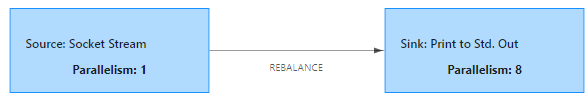

## Flink编程入门

### 使用maven命令创建项目模板

```sh
curl https://flink.apache.org/q/quickstart.sh | bash -s 1.12.1

# java项目
mvn archetype:generate \
    -DarchetypeGroupId=org.apache.flink \
    -DarchetypeArtifactId=flink-quickstart-java \
    -DarchetypeVersion=1.12.1 \
    -DgroupId=com.ngt \
    -DartifactId=frauddetection \
    -Dversion=1.0 \
    -Dpackage=com.ngt \
    -DinteractiveMode=false
    
mvn archetype:generate  -DarchetypeGroupId=org.apache.flink -DarchetypeArtifactId=flink-quickstart-java -DarchetypeVersion=1.12.0 -DgroupId=com.ngt -DartifactId=flink-java -Dversion=1.0 -Dpackage=com.ngt -DinteractiveMode=false

# scala 项目    
mvn archetype:generate \
    -DarchetypeGroupId=org.apache.flink \
    -DarchetypeArtifactId=flink-quickstart-scala \
    -DarchetypeVersion=1.12.1 \
    -DgroupId=com.ngt \
    -DartifactId=frauddetection \
    -Dversion=1.0 \
    -Dpackage=com.ngt \
    -DinteractiveMode=false

# Windows环境下删除换行符    
mvn archetype:generate -DarchetypeGroupId=org.apache.flink -DarchetypeArtifactId=flink-quickstart-scala -DarchetypeVersion=1.12.0 -DgroupId=com.ngt -DartifactId=flink-scala -Dversion=1.0 -Dpackage=com.ngt -DinteractiveMode=false
```


Flink提供了不同级别的编程抽象，通过调用抽象的数据集调用算子构建DataFlow就可以实现对分布式的数据进行流式计算和离线计算，**DataSet是批处理的抽象数据集，DataStream是流式计算的抽象数据集**，他们的方法都分别为**Source、Transformation、Sink**

- **Source**主要负责数据的读取
- **Transformation**主要负责对数据的转换操作
- **Sink**负责最终计算好的结果数据输出。

### Flink第一个入门程序

####  实时WordCount

从一个Socket端口中实时的读取数据，然后实时统计相同单词出现的次数，该程序会一直运行，启动程序前先使用 netcat 启动一个socket用来发送数据

```
错误: 无法初始化主类 com.ngt.wc.StreamWordCount
原因: java.lang.NoClassDefFoundError: org/apache/flink/api/common/functions/FlatMapFunction
```





