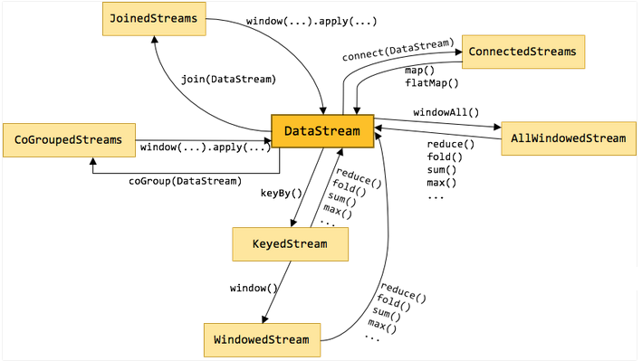
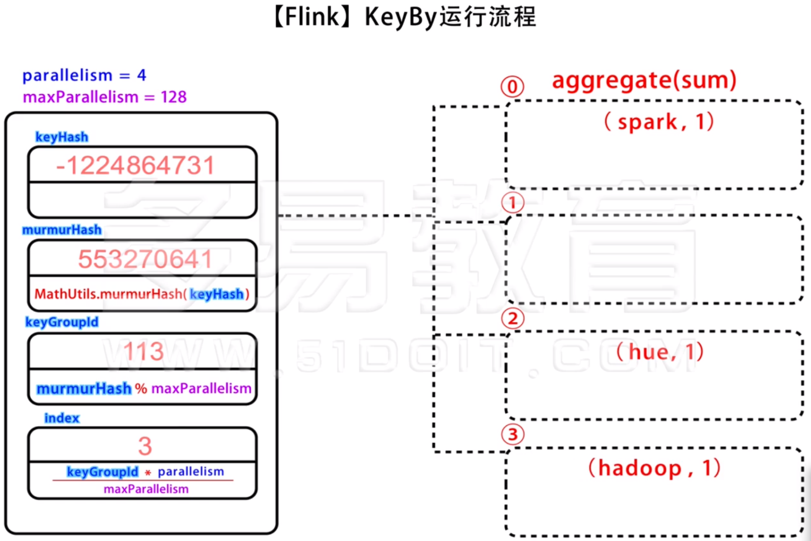
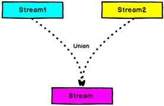
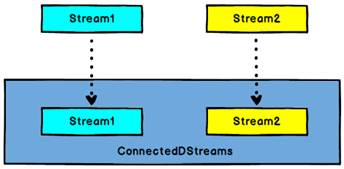
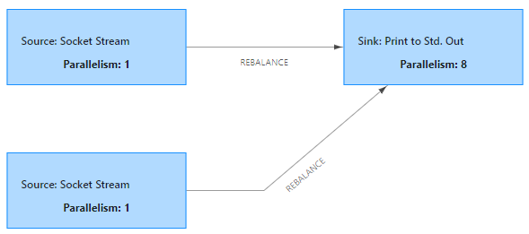
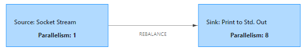

### Transformation 概述

[Apache Flink 1.12 Documentation: 算子](https://ci.apache.org/projects/flink/flink-docs-release-1.12/zh/dev/stream/operators/)

|    Transformation    |                           类型转换                           |                             描述                             |
| :------------------: | :----------------------------------------------------------: | :----------------------------------------------------------: |
|       **map**        |                   DataStream → DataStream                    |                  获取一个元素并生成一个元素                  |
|     **FlatMap**      |                   DataStream → DataStream                    |               获取一个元素并产生0、1或多个元素               |
|      **Filter**      |                   DataStream → DataStream                    |           对每个元素求值，并保留函数返回true的元素           |
|      **KeyBy**       |                   DataStream → KeyedStream                   |                 将流划分为逻辑上不相连的分区                 |
|      **Reduce**      |                   KeyedStream → DataStream                   |              将聚合值和当前值聚合生成新的聚合值              |
|   **Aggregations**   |                   KeyedStream → DataStream                   |        在KeyedStream上滚动聚合，注意min和minBy的区别         |
|      **Window**      |                 KeyedStream → WindowedStream                 |       根据某些特征(5S)将每个keyed streams中的数据分组        |
|    **WindowAll**     |                DataStream → AllWindowedStream                |               根据某些特性(5S)将所有流事件分组               |
|   **Window Apply**   | WindowedStream → DataStream<br/>AllWindowedStream → DataStream |                   将一般函数应用于整个窗口                   |
|      **Union**       |                   DataStream* → DataStream                   |                对**相同类型的几个流**进行合并                |
|   **Window Join**    |              DataStream,DataStream → DataStream              |          通过连接条件将**不同类型的两个流**进行连接          |
|  **Interval Join**   |             KeyedStream,KeyedStream → DataStream             | 连接两个 keyed streams，e1.timestamp + lowerBound <= e2.timestamp <= e1.timestamp + upperBound |
|  **Window CoGroup**  |              DataStream,DataStream → DataStream              |                                                              |
|     **Connect**      |           DataStream,DataStream → ConnectedStreams           |   “连接”两个数据流，保留它们的类型。允许两个流之间共享状态   |
| **CoMap, CoFlatMap** |                ConnectedStreams → DataStream                 |            类似于ConnectedStreams上的map和flatMap            |
|     **Iterate**      |          DataStream → IterativeStream → DataStream           |        通过迭代条件和迭代操作对DataStream进行迭代操作        |
|     **Project**      |                   DataStream → DataStream                    |     从元组类型的数据流中抽取元组中部分元素，Scala中没有      |





### map

作用：获取一个元素并生成一个元素，比如将一个 word 生成一个 (word,1) 元组

示例：flink  → (flink, 1)

手动调用 transform 实现 map 操作，

```java
/*
Params:
	operatorName – name of the operator, for logging purposes
	outTypeInfo – the output type of the operator
	operator – the object containing the transformation logic
*/
SingleOutputStreamOperator<String> myMap = lines.transform("MyMap",
                TypeInformation.of(String.class), new StreamMap<>(String::toUpperCase));
```

继承  AbstractStreamOperator< > 实现 OneInputStreamOperator< > ，如果不继承 AbstractStreamOperator 就需要实现超过 10 个方法，有两种数据输出方式：

- 创建一个 StreamRecord 的数据用于输出
- 使用 replace 方法，将要输出的数据替换原来的数据

注意数据必须使用 output.collect() 手动输出

```java
public static class MyStreamMap extends AbstractStreamOperator<String> implements OneInputStreamOperator<String, String> {
    @Override
    public void processElement(StreamRecord<String> element) throws Exception {
        String value = element.getValue();
        String upperCase = value.toUpperCase();

        // 1. 创建一个 StreamRecord 的数据用于输出
        //StreamRecord<String> stringStreamRecord = new StreamRecord<>(upperCase);
        //output.collect(stringStreamRecord);

        // 2. 推荐使用replace方法，将要输出的数据替换原来的
        element.replace(upperCase);

        // 必须手动输出数据
        output.collect(element);
    }
}
```


### flatmap

作用：扁平化映射，获取一个元素并产生0、1或多个元素，

示例：flink, spark, hadoop → (flink, 1)  (spark, 1)  (hadoop, 1)，将一行数据拆分成多个元组

```java
// Map 对于每个输入都必须有输出
new MapFunction<String, String>() {
    @Override
    public String map(String value) throws Exception {
        return null;
    }
}

// FlatMapFunction 可以通过 out.collect() 对于1个输入实现0个、1个或多个输出
new FlatMapFunction<String, String>() {
    @Override
    public void flatMap(String value, Collector<String> out) throws Exception {
    }
}
```

输出流中除 "error" 之外的字符串

```java
SingleOutputStreamOperator<String> mapOut = lines.flatMap(new FlatMapFunction<String, String>() {
    @Override
    public void flatMap(String value, Collector<String> out) throws Exception {
        String[] words = value.split(" ");
        for (String word : words) {
            if (!"error".equals(word)) {
                out.collect(word);
            }
        }
    }
});
```

继承  AbstractStreamOperator< > 实现 OneInputStreamOperator< >

```java
SingleOutputStreamOperator<String> myFlatMap = lines.transform("MyFlatMap",
                TypeInformation.of(String.class), new MyFlatMap());

public static class MyFlatMap extends AbstractStreamOperator<String> implements OneInputStreamOperator<String, String> {
    @Override
    public void processElement(StreamRecord<String> element) throws Exception {
        String line = element.getValue();
        String[] words = line.split(" ");
        for (String word : words) {
            if (!"error".equals(word)) {
                // 注意此处要使用 replace 方法替换
                output.collect(element.replace(word));
            }
        }
    }
}
```


### Filter

作用：对流进行过滤，保留符合条件的元素

示例： 1, 2, 3, 4, 5, 6  ===\>  filter(i -> (i & 1) == 0)  \=\==>  2,4,6

```java
SingleOutputStreamOperator<Integer> filter = nums.filter(new FilterFunction<Integer>() {
    @Override
    public boolean filter(Integer value) throws Exception {
        return (value & 1) == 0;
    }
});

SingleOutputStreamOperator<Integer> filter1 = nums.filter(i -> (i & 1) == 0);

SingleOutputStreamOperator<Integer> myFilter = nums.transform("MyFilter", TypeInformation.of(Integer.class), new MyStreamFilter());

public static class MyStreamFilter extends AbstractStreamOperator<Integer> implements OneInputStreamOperator<Integer, Integer> {
    @Override
    public void processElement(StreamRecord<Integer> element) throws Exception {
        Integer value = element.getValue();
        if ((value & 1) == 0) {
            output.collect(element.replace(value));
        }
    }
}
```


### keyby

作用：将流划分为逻辑上不相连的分区，输入类型必须是元组，Java lambda表达式还需要使用returns 指定类型

```java
// 1. 使用下标，只适用于元组，新版中已过时
map.keyBy(0).sum(1).print();

// 2. 使用 KeySelector
map.keyBy(new KeySelector<Tuple2<String, Integer>, String>() {
    @Override
    public String getKey(Tuple2<String, Integer> value) throws Exception {
        return value.f0;
    }
}).sum(1).print();

// 3. 使用 lambda 表达式，此时类型可以省略
map.keyBy(d -> d.f0).sum(1).print();
```

同时使用多个字段作为分组的依据，有两种方式：

- 将多个字段直接进行相加，实现简答，但是不便于后续的操作
- 将多个字段组合成元组，实现稍微复杂，但是后续操作方便

```java
// 1. 同时使用多个字段作为分组的依据
provinceCityAndMoney.keyBy(0, 1).sum(2).print();

// 2. 使用 KeySelector, 将两个字段相加
provinceCityAndMoney.keyBy(new KeySelector<Tuple3<String, String, Double>, String>() {
    @Override
    public String getKey(Tuple3<String, String, Double> value) throws Exception {
        return value.f0 + value.f1;
    }
}).sum(2).print();

// 3. 使用 KeySelector, 将两个字段构成一个元组
provinceCityAndMoney.keyBy(new KeySelector<Tuple3<String, String, Double>, Tuple2<String, String>>() {
    @Override
    public Tuple2<String, String> getKey(Tuple3<String, String, Double> value) throws Exception {
        return Tuple2.of(value.f0, value.f1);
    }
}).sum(2).print();

// 4. 使用 lambda 表达式，将两个字段相加
provinceCityAndMoney.keyBy(value -> value.f0 + value.f1).sum(2).print();

// 5. 使用 lambda 表达式，将两个字段构成一个元组
provinceCityAndMoney.keyBy(value -> Tuple2.of(value.f0, value.f1)).sum(2).
    returns(Types.TUPLE(Types.STRING, Types.STRING, Types.DOUBLE)).print();
```





### reduce

作用：将聚合值和当前值聚合生成新的聚合值

示例：可以使用reduce 实现 wordcount

```java
SingleOutputStreamOperator<Tuple2<String, Integer>> reduced = keyed.reduce(new ReduceFunction<Tuple2<String, Integer>>() {
    @Override
    public Tuple2<String, Integer> reduce(Tuple2<String, Integer> value1, Tuple2<String, Integer> value2) throws Exception {
        value1.f1 = value1.f1 + value2.f1;
        return value1;
    }
});
```


### Aggregations

min和minBy的区别：

- min返回的是参与分组的字段和要比较字段的最小值，如果数据中还有其他字段，其他字段的值是总是第一次输入的数据的值。
- minBy返回的是要比较的最小值对应的全部数据。

```java
KeyedStream<Tuple2<String, Integer>, String> keyed = wordAndNum.keyBy(data -> data.f0);

SingleOutputStreamOperator<Tuple2<String, Integer>> resMin = keyed.min(1);
resMin.print();

SingleOutputStreamOperator<Tuple2<String, Integer>> resMax = keyed.max(1);
resMax.print();

// min 不会更新非分区字段
provinceCityAndMoney.keyBy(t -> t.f0).min(2).print();

// minBy 会更新非分区字段，会返回第一个具有最小值的元素
provinceCityAndMoney.keyBy(t -> t.f0).minBy(2).print();

// minBy 会更新非分区字段，当第二次参数为 false 的时候，会返回最后个具有最小值的元素
provinceCityAndMoney.keyBy(t -> t.f0).minBy(2, false).print();
```


### Union



作用：合并 2 个或多个相同类型的流

示例：

注意 Union 要求相互连接的流类型必须一样

```java
DataStreamSource<String> lines1 = env.socketTextStream("192.168.31.8", 8888);
DataStreamSource<String> lines2 = env.socketTextStream("192.168.31.8", 9999);

// 两个 source 分支
lines1.union(lines2).print();

// 只有一个source分支，重复发送两次
lines1.union(lines1).print();

DataStreamSource<Integer> elements = env.fromElements(1, 2, 3, 4, 5, 6, 7, 8, 9, 0);

// Union 要求流的数据类型必须相同
// lines1.union(elements)
```


### Window Join

官方文档 [Apache Flink 1.12 Documentation: Joining](https://ci.apache.org/projects/flink/flink-docs-release-1.12/zh/dev/stream/operators/joining.html)

作用：通过连接条件将两个流连接到一起，最终形成一个新的流

示例：将两个 wordcount 流，Join 成一个新的 wordcount  流

```java
DataStream<Tuple2<String, Integer>> apply = keyBy1.join(keyBy2)
    .where(data -> data.f0)
    .equalTo(data -> data.f0)
    .window(TumblingProcessingTimeWindows.of(Time.seconds(10)))
    .apply(new JoinFunction<Tuple2<String, Integer>, Tuple2<String, Integer>, Tuple2<String, Integer>>() {
        @Override
        public Tuple2<String, Integer> join(Tuple2<String, Integer> first, Tuple2<String, Integer> second) throws Exception {
            return Tuple2.of(first.f0, first.f1 + second.f1);
        }
    });
```


### IntervalJoin

作用：连接两个 keyed streams，e1.timestamp + lowerBound <= e2.timestamp <= e1.timestamp + upperBound

注意：时间必须是  EventTime 

```java
wordAndOne1.keyBy(data -> data.f0)
    .intervalJoin(wordAndOne2.keyBy(data -> data.f0))
    //                .inEventTime()
    .between(Time.seconds(-2), Time.seconds(2))
    .process(new ProcessJoinFunction<Tuple2<String, Integer>, Tuple2<String, Integer>, Tuple2<String, Integer>>() {
        @Override
        public void processElement(Tuple2<String, Integer> left, Tuple2<String, Integer> right,
                                   Context ctx, Collector<Tuple2<String, Integer>> out) throws Exception {
            out.collect(Tuple2.of(left.f0, left.f1 + right.f1));
        }
    }).print();
```


### Connect

作用：两个数据流被 Connect 之后，只是被放在了一个同一个流中，内部依然**保持各自的数据和形式不发生任何变化**，两个流相互独立，可以共享状态



```java
// 允许两个流之间共享状态
ConnectedStreams<String, Double> connect = lines1.connect(map);

// 流1的类型，流2的类型，生成新流的类型
SingleOutputStreamOperator<String> result = connect.map(new CoMapFunction<String, Double, String>() {
    @Override
    public String map1(String value) throws Exception {
        return value.toUpperCase();
    }

    @Override
    public String map2(Double value) throws Exception {
        return value * 10 + "";
    }
    // 两个流的map方法执行完的返回值会放入到新的流中
});
```


### Iterate

作用：通过迭代条件和迭代操作对DataStream进行迭代操作

```java
// 调用 iterate 方法 DataStrea -> IterativeStream
IterativeStream<Long> iteration = numbers.iterate();

// 迭代操作
SingleOutputStreamOperator<Long> iterationBody = iteration.map(new MapFunction<Long, Long>() {
    @Override
    public Long map(Long value) throws Exception {
        System.out.println("iterate input =>" + value);
        return (value -= 2);
    }
});

// 继续迭代的条件
SingleOutputStreamOperator<Long> feedback = iterationBody.filter(new FilterFunction<Long>() {
    @Override
    public boolean filter(Long value) throws Exception {
        return value > 0;
    }
});

// 传入迭代的条件
iteration.closeWith(feedback);

// 退出迭代的条件
SingleOutputStreamOperator<Long> output = iterationBody.filter(new FilterFunction<Long>() {
    @Override
    public boolean filter(Long value) throws Exception {
        return value <= 0;
    }
});

output.print("output value");
```





