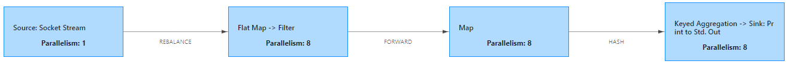
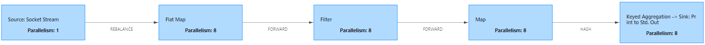

## Window的概述

官方文档 [Apache Flink 1.12 Documentation: 窗口](https://ci.apache.org/projects/flink/flink-docs-release-1.12/zh/dev/stream/operators/windows.html)

[Java代码](../java/src/main/java/com/ngt/window/)
[Scala代码](../scala/src/main/scala/com/ngt/window/)

### 时间窗口和计数窗口

**GlobalWindow**：按照指定的数据条数生成一个Window，与时间无关。

**TimeWindow**：按照时间生成Window，可以根据窗口实现原理的不同分成三类：滚动窗口（Tumbling Window）、滑动窗口（Sliding Window）和会话窗口（Session Window）

### Non-Keyed和Keyed

在划分Window之前，首先要确定该DataStream是否调用了key算子将数据按照key进行分组了。

1. 如果没有调用keyBy算子，可以调用windowAll方法的返回一个AllWindowedStream，这种window叫做Non-Keyed Windows（未分组的Widnows）；
2. 如果事先已经调用了keyBy算子，即对KeyedStream可以调用window方法返回一个WindowedStream，这种window叫做Keyed Windows（分组的Widnows）。
3. 由于调用windowAll/window算子后会生成会生成新WindowedStream/WindowedStream，所以窗口算也是属于Transformation。

### Non-Keyed

```java
stream
.windowAll(…)                             //<-  必选方法: 指定相应的窗口分配器       
[.trigger(…)]                             //<-  可选方法: 指定触发器，如果不指定有默认的触发器       
[.evictor(…)]                             //<-  可选方法: 指定剔除器，如果不指定有默认的剔除器       
[.allowedLateness(…)]                     //<-  可选方法: 指定延迟触发时间，如果不指定，默认为0       
[.sideOutputLateData(…)]                  //<-  可选方法: 指定延迟数据的侧流输出的Tag        
.sum/reduce/aggregate/fold/apply()        //<-  必选方法: 指定窗口函数       
[.getSideOutput(…)]                       //<-  可选方法: 指定侧流数据的Tag
```

**windowAll()**：划分Non-Keyed Windows，参数为指定的Window Assinger。

**trigger()：**指定触发器，如果不指定有默认的触发器。

**evictor()：**指定剔除器，如果不指定有默认的剔除器。

**allowedLateness()：**指定延迟触发时间，如果不指定，默认为0。

**sideOutputLateData()：**指定延迟数据的侧流输出的tag，用来筛选出打上指定tag的迟到数据

**sum/reduce/aggregate/fold/apply()：**指定窗口函数，窗口触发时会应该改函数对窗口中的数据进行计算。

**getSideOutput()：**指定侧流数据的tag，筛选出指定tag类型的数据。


### Keyed 

```java
stream
.keyKey(…)                                //<-  先对DataStream调用keyBy得到keyedStream
.window(…)                                //<-  必选方法: 指定相应的窗口分配器       
[.trigger(…)]                             //<-  可选方法: 指定触发器，如果不指定有默认的触发器       
[.evictor(…)]                             //<-  可选方法: 指定剔除器，如果不指定有默认的剔除器       
[.allowedLateness(…)]                     //<-  可选方法: 指定延迟触发时间，如果不指定，默认为0       
[.sideOutputLateData(…)]                  //<-  可选方法: 指定延迟数据的测流输出的Tag        
.sum/reduce/aggregate/fold/apply()        //<-  必选方法: 指定窗口函数       
[.getSideOutput(…)]                       //<-  可选方法: 指定测流数据的Tag
```

**keyBy()**：按照key进行分组，参数为一或多个分组字段

**windw()**：划分keyed Windows，参数为指定的Window Assinger


## CountWindow

### Non-Keyed

1. countWindowAll滑动聚合操作，使用 sum 实现

```java
DataStreamSource<String> lines = env.socketTextStream("192.168.31.8", 8888);
SingleOutputStreamOperator<Integer> nums = lines.map(Integer::parseInt);

nums.countWindowAll(4, 2)
    .sum(0)
    .print();
```

```
3
4  →  7
5
2  →  14
8
9  →  24
```

> 注意，当输入两个数据的时候就会输出结果

2. countWindowAll滑动聚合操作，使用 reduce 实现

```java
DataStreamSource<String> lines = env.socketTextStream("192.168.31.8", 8888);
SingleOutputStreamOperator<Integer> nums = lines.map(Integer::parseInt);

nums.countWindowAll(4, 2)
    .reduce(new ReduceFunction<Integer>() {
        @Override
        public Integer reduce(Integer value1, Integer value2) throws Exception {
            return value1 + value2;
        }
    })
    .print();
```

> 同上，当输入两个数据的时候就会输出结果

3. countWindowAll滑动聚合操作，使用 apply 实现窗口内排序输出。 apply 不使用增量操作，将窗口内的数据先存起来，放在WindowState中。

```java
DataStreamSource<String> lines = env.socketTextStream("192.168.31.8", 8888);
SingleOutputStreamOperator<Integer> nums = lines.map(Integer::parseInt);

nums.countWindowAll(5)
    .apply(new AllWindowFunction<Integer, Integer, GlobalWindow>() {
        @Override
        public void apply(GlobalWindow window, Iterable<Integer> values, Collector<Integer> out) throws Exception {
            ArrayList<Integer> list = new ArrayList<>();
            for (Integer value : values) {
                list.add(value);
            }
            list.sort(Integer::compareTo); // 升序
            //                list.sort(Comparator.reverseOrder()); // 降序
            for (Integer i : list) {
                out.collect(i);
            }
        }
    })
    .print()
    .setParallelism(1); // 为了保证输出时有序，需要设置并行度为 1 
```

### Keyed

```java
wordAndCount.keyBy(t -> t.f0)
    .countWindow(3)
    .sum(1)
    .print();
```

## EvenTimeWindow

1. Flink 1.12 默认的时间就是 EvenTime，不在需要通过 `env.setStreamTimeCharacteristic(TimeCharacteristic.EventTime);` j进行指定。

2. 可以通过  `assignTimestampsAndWatermarks`  进行设定，注意Java和Scala存在区别：
   - java 中需要显示指定 forBoundedOutOfOrderness 的类型
   - scala 中则不需要显示指定 forBoundedOutOfOrderness  的类型

```java
// 1609512630000,a,1
DataStreamSource<String> lines = env.socketTextStream("192.168.31.8", 8888);

SingleOutputStreamOperator<Tuple3<Long, String, Integer>> timeAndCount = lines.map(data -> {
    String[] split = data.split(",");
    return Tuple3.of(Long.valueOf(split[0]), split[1], Integer.valueOf(split[2]));
}).returns(Types.TUPLE(Types.LONG, Types.STRING, Types.INT));


timeAndCount.assignTimestampsAndWatermarks(WatermarkStrategy
	.<Tuple3<Long,String,Integer>>forBoundedOutOfOrderness(
        Duration.ofSeconds(0)).withTimestampAssigner((element, recordTimestamp) -> element.f0));
```


```scala
// 1609512630000,1
val lines: DataStream[String] = env.socketTextStream("192.168.31.8", 8888)

val wordAndCount: DataStream[(Long, Int)] = lines.map(data => {
    val strings: Array[String] = data.split(",")
    (strings(0).toLong, strings(1).toInt)
})

wordAndCount.assignTimestampsAndWatermarks(
    WatermarkStrategy.forBoundedOutOfOrderness(Duration.ZERO)
    .withTimestampAssigner(new SerializableTimestampAssigner[(Long, Int)] {
        override def extractTimestamp(element: (Long, Int), recordTimestamp: Long): Long = element._1
    }))
.setParallelism(1)
```

3. Scala 还可以通过 `assignAscendingTimestamps` 方便的指定数据中的时间

```java
val lines: DataStream[String] = env.socketTextStream("192.168.31.8", 8888)

val wordAndCount: DataStream[(Long, Int)] = lines.map(data => {
    val strings: Array[String] = data.split(",")
    (strings(0).toLong, strings(1).toInt)
})
    .assignAscendingTimestamps(_._1) // 使用 元组第一个元素，作为时间
```


## ProcessingTime

场景：要尽可能快地得到结果，即使有小的误差也没关系的场景

ProcessingTime 不需要从输入的数据中去获取，系统给会自动获取


## Window Assigners

### Tumbling Windows

将数据依据固定的窗口⻓度对数据进行切片。特点：时间对⻬，窗口⻓度固定，没有重叠。


```java
nums.windowAll(TumblingProcessingTimeWindows.of(Time.seconds(5)));
wordAndCount.keyBy(t -> t.f0).window(TumblingProcessingTimeWindows.of(Time.seconds(10)));
```


### Sliding Windows

滑动窗口是固定窗口的更广义的一种形式，滑动窗口由固定的窗口⻓度和滑动间隔组成。   特点：时间对⻬，窗口⻓度固定，有重叠。


> 注意，滑动步长可以大于滑动窗口的大小

```java
nums.windowAll(SlidingProcessingTimeWindows.of(Time.seconds(10), Time.seconds(5)));
wordAndCount.keyBy(t -> t.f0).window(SlidingProcessingTimeWindows.of(Time.seconds(30), Time.seconds(10)));
```


### Session Windows

由一系列事件组合一个指定时间⻓度的timeout间隙组成，类似于web应用的session，也就是一段时间没有接收到新数据就会生成新的窗口。


```java
nums.windowAll(ProcessingTimeSessionWindows.withGap(Time.seconds(10)));
// 根据数据中元素的不同值动态生成 Gap 
wordAndCount.keyBy(t -> t.f0).window(ProcessingTimeSessionWindows.withDynamicGap(element -> element.f1 * 5000));   
```


### Global Windows


```java
wordAndCount.keyBy(t -> t.f0).window(GlobalWindows.create())
```


## Window Functions
[Java代码](../java/src/main/java/com/ngt/function/)
[Scala代码](../scala/src/main/scala/com/ngt/function/)

### ReduceFunction

聚合操作，使用 ReduceFunction 可以自定义窗口中的聚合操作。

```java
wordAndCount.keyBy(t -> t.f0)
    .window(TumblingProcessingTimeWindows.of(Time.seconds(10)))
    .reduce((ReduceFunction<Tuple2<String, Integer>>) (value1, value2) -> {
        value1.f1 = value1.f1 + value2.f1;
        return value1;
    }).print();
```

### AggregateFunction

1. AggregateFunction 是 ReduceFunction 的一般化版本，需要指定输入类型(IN)、累加类型(ACC)和输出类型(OUT)。
2. 输入类型是输入流中的元素类型，AggregateFunction有一个将一个输入元素添加到累加器的方法。
3. 该接口还提供了用于创建初始累加器、将两个累加器合并到一个累加器以及从累加器提取输出(类型为OUT)的方法
4. merge 方法只有 SessionWindow 条件下需要实现，其他场景可以不实现。

```java
private static class AverageAggregate implements AggregateFunction<Tuple2<String, Long>, Tuple2<Long, Long>, Tuple2<String,Double>> {
    private String key; // 获取分组的 key 用于输出
    @Override
    public Tuple2<Long, Long> createAccumulator() {
        return new Tuple2<>(0L, 0L);
    }

    @Override
    public Tuple2<Long, Long> add(Tuple2<String, Long> value, Tuple2<Long, Long> accumulator) {
        key = value.f0;
        return new Tuple2<>(accumulator.f0 + value.f1, accumulator.f1 + 1L);
    }

    @Override
    public Tuple2<String,Double> getResult(Tuple2<Long, Long> accumulator) {
        return Tuple2.of(key,((double) accumulator.f0) / accumulator.f1);
    }

    // 非 SessionWindow，可以不实现
    @Override
    public Tuple2<Long, Long> merge(Tuple2<Long, Long> a, Tuple2<Long, Long> b) {
        return new Tuple2<>(a.f0 + b.f0, a.f1 + b.f1);
    }
}
```

### ProcessWindowFunction

```
Type parameters:
<IN> – The type of the input value.
<OUT> – The type of the output value.
<KEY> – The type of the key.
<W> – The type of Window that this window function can be applied on.
```


```java
timeAndCount.keyBy(data -> data.f0)
    .window(TumblingEventTimeWindows.of(Time.seconds(5)))
    .process(new ProcessWindowFunction<Tuple2<String, Integer>, Tuple2<String, Integer>, String, TimeWindow>() {
        // 窗口触发，才会调用Process方法，该方法可以获取窗口内全量数据，数据缓存到 WindowState中
        @Override
        public void process(String key, Context context, Iterable<Tuple2<String, Integer>> elements, Collector<Tuple2<String, Integer>> out) throws Exception {
            for (Tuple2<String, Integer> element : elements) {
                out.collect(element);
            }
        }
    })
    .print();
```

### ProcessWindowFunction 增量聚合

####  ReduceFunction
使用reduce通过状态实现增量聚合操作：reduce(new ReduceFunction(), new ProcessWindowFunction())
```java
// 在窗口中进行增量聚合，直接调用sum和reduce方法只会聚合窗口中的数据，不会聚合历史数据
timeAndCount.keyBy(data -> data.f0)
    .window(TumblingEventTimeWindows.of(Time.seconds(5)))
    .reduce(new MyReduceFunction(), new MyWindowFunction())
    .print();

private static class MyReduceFunction implements ReduceFunction<Tuple2<String, Integer>> {
    @Override
    public Tuple2<String, Integer> reduce(Tuple2<String, Integer> value1, Tuple2<String, Integer> value2) throws Exception {
        value1.f1 = value1.f1 + value2.f1;
        return value1;
    }
}

// 通过状态，对所有的数据进行聚合而不仅是当前窗口内的数据
private static class MyWindowFunction extends ProcessWindowFunction<Tuple2<String, Integer>, Tuple2<String, Integer>, String, TimeWindow> {
    private transient ValueState<Integer> sumState;

    @Override
    public void open(Configuration parameters) throws Exception {
        ValueStateDescriptor<Integer> stateDescriptor = new ValueStateDescriptor<>("wc", Integer.class);
        sumState = getRuntimeContext().getState(stateDescriptor);
    }

    @Override
    public void process(String s, Context context, Iterable<Tuple2<String, Integer>> elements, Collector<Tuple2<String, Integer>> out) throws Exception {
        Integer historyCount = sumState.value();
        if (historyCount == null) {
            historyCount = 0;
        }
        Tuple2<String, Integer> tp = elements.iterator().next();
        tp.f1 += historyCount;
        // 必须要更新状态
        sumState.update(tp.f1);
        out.collect(tp);
    }
}
```

####  AggregateFunction
使用aggregate通过状态实现增量聚合操作：aggregate(new AggregateFunction(), new ProcessWindowFunction())
```java
timeAndCount.keyBy(data -> data.f0)
    .window(TumblingEventTimeWindows.of(Time.seconds(5)))
    .aggregate(new MyAggFunc(), new MyWindowFunction())
    .print();

private static class MyAggFunc implements AggregateFunction<Tuple2<String, Integer>, Integer, Integer> {
    @Override
    public Integer createAccumulator() {
        return 0;
    }

    @Override
    public Integer add(Tuple2<String, Integer> value, Integer accumulator) {
        return value.f1 + createAccumulator();
    }

    @Override
    public Integer getResult(Integer accumulator) {
        return accumulator;
    }

    // 非 SessionWindow，可以不实现
    @Override
    public Integer merge(Integer a, Integer b) {
        return null;
    }
}

// 通过状态，对所有的数据进行聚合而不仅是当前窗口内的数据
private static class MyWindowFunction extends ProcessWindowFunction<Integer, Tuple2<String, Integer>, String, TimeWindow> {

    private transient ValueState<Integer> sumState;

    @Override
    public void open(Configuration parameters) throws Exception {
        ValueStateDescriptor<Integer> stateDescriptor = new ValueStateDescriptor<>("wc", Integer.class);
        sumState = getRuntimeContext().getState(stateDescriptor);
    }

    @Override
    public void process(String key, Context context, Iterable<Integer> elements, Collector<Tuple2<String, Integer>> out) throws Exception {

        Integer historyCount = sumState.value();
        if (historyCount == null) {
            historyCount = 0;
        }
        Integer windowCount = elements.iterator().next();
        sumState.update(windowCount + historyCount);
        out.collect(Tuple2.of(key, windowCount + historyCount));
    }
}
```

### Using per-window state in ProcessWindowFunction

ProcessWindowFunction还可以使用函数当前正在处理的窗口范围内的键控状态

### WindowFunction 
```java
window.apply(new AllWindowFunction<Integer, Integer, GlobalWindow>() {
    @Override
    public void apply(GlobalWindow window, Iterable<Integer> values, Collector<Integer> out) throws Exception {
        ArrayList<Integer> list = new ArrayList<>();
        for (Integer value : values) {
            list.add(value);
        }
        list.sort(Integer::compareTo); // 升序
        //                list.sort(Comparator.reverseOrder()); // 降序
        for (Integer i : list) {
            out.collect(i);
        }
    }
})
```


## 旁路输出

1. 旁路输出也叫测流输出，除了由 `DataStream` 操作产生的主要流之外，你还可以产生任意数量的旁路输出结果流。
2. 结果流中的数据类型不必与主要流中的数据类型相匹配，并且不同旁路输出的类型也可以不同。
3. 当你需要拆分数据流时，通常必须复制该数据流，然后从每个流中过滤掉不需要的数据，这个操作十分有用。


### 数据过滤

```java
// 1. 定义测流
OutputTag<String> oddOutputTag = new OutputTag<>("odd") { };// 奇数
OutputTag<String> evenOutputTag = new OutputTag<>("even") { };// 偶数
OutputTag<String> nanOutputTag = new OutputTag<>("nan") { };// 非数字

SingleOutputStreamOperator<String> mainStream = lines.process(new ProcessFunction<String, String>() {
    @Override
    public void processElement(String value, Context ctx, Collector<String> out) throws Exception {
        try {
            int i = Integer.parseInt(value);
            if ((i & 1) == 1) {
                ctx.output(oddOutputTag, value);
            } else {
                ctx.output(evenOutputTag, value);
            }

        } catch (NumberFormatException e) {
            ctx.output(nanOutputTag, value);
        }
        // 主流中输出全部的数据，否则主流没有输出
        out.collect(value);
    }
});

mainStream.getSideOutput(evenOutputTag).print("even");
mainStream.getSideOutput(oddOutputTag).print("odd");
mainStream.print("main");    
```

> 注意要将所有数据输出到主流中，否则主流中将没有任何输出

### 处理迟到数据

```java
// 处理迟到数据
OutputTag<Tuple3<Long, String, Integer>> lastoutputTag = new OutputTag<>("last") { };

// 如果 operator 并行度大于1 那么每个窗口的时间满足条件才会触发窗口
WindowedStream<Tuple3<Long, String, Integer>, String, TimeWindow> mainStream = operator.keyBy(data -> data.f1)
    .window(TumblingEventTimeWindows.of(Time.seconds(5)))
    .sideOutputLateData(lastoutputTag);

SingleOutputStreamOperator<Tuple3<Long, String, Integer>> sumed = mainStream.sum(2);
sumed.print();
// 主流中获取迟到的数据
sumed.getSideOutput(lastoutputTag).print("lastdata");
```







